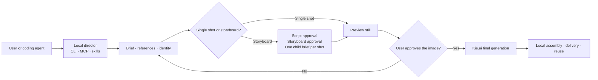
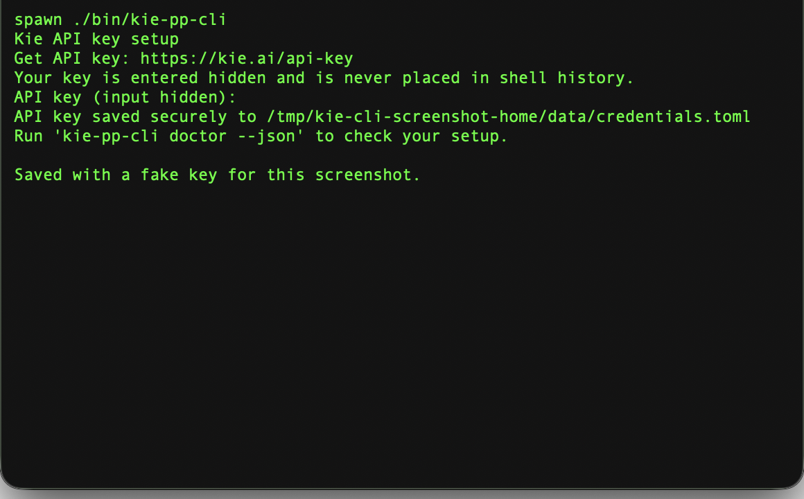

# kie-cli — the open-source agent media factory for Kie.ai

<pre align="center">
 _  _____ _____
| |/ /_ _| ____|
| ' / | ||  _|
| . \ | || |___
|_|\_\___|_____|

AGENT MEDIA FACTORY
[ BRIEF ] -> [ PREVIEW ] -> [ APPROVE ] -> [ CREATE ]
</pre>

<p align="center">
  <strong>Turn Codex, Claude Code, Cursor, or any MCP-capable agent into a guided image and video production studio.</strong>
</p>

<p align="center">
  Seedance 2.5 · Local-first direction · CLI · Stateless MCP · 9 agent skills · 129 typed models · Human approval gates
</p>

<p align="center">
  <a href="docs/VIBE_CODER_QUICKSTART.md">Start with a coding assistant</a> ·
  <a href="docs/MEDIA_DIRECTOR.md">CLI and MCP reference</a> ·
  <a href="docs/SCRIPT_AND_STORYBOARD.md">Script and storyboard</a> ·
  <a href="docs/ADVANCED_MEDIA_DIRECTOR.md">Advanced operation</a> ·
  <a href="docs/MODELS.md">Model catalog</a>
</p>

`kie-cli` combines Kie.ai's broad generation API with a local creative director
that agents can operate through terminal commands or MCP. It qualifies the
request one question at a time, keeps briefs and reusable references on the
user's machine, plans the production, and asks before spending credits.

For video, the factory enforces a human-in-the-middle review: each shot gets a
generated still, the user sees it, and the CLI requires explicit approval before
submitting the final motion job. Longer productions add durable scripts,
storyboards, one child brief per shot, and a transparent local assembly step.

This is an open-source, bring-your-own-Kie-key alternative to closed agent media
suites such as [Higgsfield's CLI and MCP workflow](https://higgsfield.ai/cli).
It takes inspiration from that agent-first experience; it is not a drop-in
Higgsfield clone and does not claim unsupported provider features.

> The repository is named `kie-cli`; the generated command installed by this
> project is `kie-pp-cli`.

## What ships

| Surface | Current capability |
| --- | --- |
| Local media director | Guided, resumable image and video briefs with one question per turn |
| Production planning | Single-shot or multi-shot script/storyboard workflows with durable IDs |
| Video safety gate | Preview still → display to user → explicit approval → final video |
| Creative memory | Private image/video/audio reference vault and consented likeness bundles |
| Agent access | Compact `--agent` JSON, durable handles, focused MCP, and reusable skills |
| Focused MCP | 25 media tools over stdio or loopback stateless HTTP using MCP `2026-07-28` |
| Skills | 1 core director skill plus 8 production skills for common media jobs |
| Kie coverage | 70 current API operations plus 129 Market models with complete embedded input/settings schemas |
| Local learning | SQLite-backed recall, teach, playbooks, and command discovery for repeat work |
| Broad generated CLI | Image, video, music, speech, chat, upload, account, and task endpoints |

## How the factory works



The local state is durable but the protocol is stateless: agents pass opaque
`brief_...`, `ref_...`, `identity_...`, `script_...`, `storyboard_...`, and
`gen_...` handles between commands instead of repeatedly loading the full
production context into their prompt.

## Quick start

Requires Go 1.26.5 or newer.

```bash
git clone https://github.com/kelvincushman/kie-cli.git
cd kie-cli
make build-all
export PATH="$PWD/bin:$PATH"
```

`make build-all` creates:

- `bin/kie-pp-cli`: the full CLI and local media director.
- `bin/kie-media-mcp`: the focused agent media server.
- `bin/kie-pp-mcp`: the broad generated Printing Press MCP server.

## First run

Run `kie-pp-cli` with no arguments in an interactive terminal. If no credential
is saved, it starts the setup wizard. The wizard shows the **Get API key** link,
masks your entry, and saves it in the existing private credential store. You can
also start it at any time with `kie-pp-cli auth setup`.



For scripts, agents, and CI, set `KIE_BEARER_AUTH` through that environment's
secret store. `--agent`, `--json`, `--no-input`, `--help`, and `--version` never
start the wizard. Never paste a key into a media brief, agent prompt, issue,
log, or storyboard.

Start creating:

```bash
kie-pp-cli create "a cinematic website hero for my coffee brand"
```

The command creates a local brief and asks the next useful question. Resume the
same brief until it returns a ready plan, then explicitly submit it.

## Give the factory to a coding agent

Install the repository's Markdown skills:

```bash
npx skills add kelvincushman/kie-cli
```

Register the focused MCP server with a local Claude Code installation:

```bash
claude mcp add kie-media -- "$PWD/bin/kie-media-mcp"
```

Other MCP hosts can launch `kie-media-mcp` over stdio. Loopback-only stateless
HTTP is also available:

```bash
kie-media-mcp --transport http --addr 127.0.0.1:7780
```

For a complete copy-paste setup and first-job prompt, use the
[Vibe Coder Quickstart](docs/VIBE_CODER_QUICKSTART.md). It tells the agent to
verify the binaries, protect the API key, ask one question at a time, show plans
before live calls, and enforce every preview gate.

## Direct an image or single-shot video

Agents should add `--agent` for compact, machine-readable, non-interactive
output:

```bash
kie-pp-cli media workflow list --agent
kie-pp-cli media workflow show product-photoshoot --agent
kie-pp-cli create --workflow product-photoshoot \
  "a vertical launch image for a premium coffee grinder" \
  --type image --agent
```

Resume by durable brief ID and answer only the returned next question:

```bash
kie-pp-cli create --brief brief_ab12cd34 --answer "Instagram launch" --agent
```

For video, preview and final generation are deliberately separate live actions:

```bash
kie-pp-cli create "a vertical launch video" --type video --agent
kie-pp-cli create --brief brief_ab12cd34 --preview --wait --agent
# Display result_urls[0] to the user and wait for an explicit yes.
kie-pp-cli create --brief brief_ab12cd34 --approve-preview --agent
kie-pp-cli create --brief brief_ab12cd34 --submit --wait --agent
```

If the image is wrong, use `--reject-preview`, revise the brief, and generate a
new still. Changing a creative field invalidates the prior approval.

## Reuse references and likenesses

References may be supported local image/video/audio paths, HTTP(S) URLs, or
private `ref:<id>` handles. Dragging a file into a terminal normally inserts a
path that can be passed directly to the command.

```bash
kie-pp-cli media reference add ./brand/logo.png --name brand-logo --agent
kie-pp-cli create "a cinematic website hero" \
  --reference ref:ref_ab12cd34 --agent
```

Consented likeness bundles keep a reusable set of reference photographs local
until an approved live generation action:

```bash
kie-pp-cli media identity create "Creator" \
  --reference ./front.jpg --reference ./profile.jpg --consent --agent
kie-pp-cli create "Creator introducing the product" \
  --type video --video-mode multimodal \
  --identity identity_ab12cd34 --agent
```

Identity bundles are local reference packs, not trained biometric models or a
portable equivalent of Higgsfield Soul.

## Produce a multi-shot video

Storyboard mode keeps the master production separate from the individual Kie
jobs. The master brief cannot be submitted as a single prompt-only video.

```bash
kie-pp-cli create "a 30-second product story" \
  --type video --duration 30 --production-mode storyboard --agent

kie-pp-cli media script set <brief_id> --file script.md --agent
kie-pp-cli media script show <brief_id> --agent
kie-pp-cli media script approve <brief_id> --agent

kie-pp-cli media storyboard set <brief_id> --file storyboard.json --agent
kie-pp-cli media storyboard show <brief_id> --agent
kie-pp-cli media storyboard approve <brief_id> --agent
```

The storyboard returns one ordinary `shot_brief_id` per shot. Run the preview,
display, approval, and final-generation sequence separately for every shot,
then assemble the approved clips locally with ffmpeg, Remotion, or an editor.
See [Script and Storyboard Workflow](docs/SCRIPT_AND_STORYBOARD.md).

## Nine production skills

The `skills/` directory contains a core director and eight Kie-native production
workflows. They keep domain guidance out of repeated agent prompts while handing
compact workflow names and durable handles back to the CLI/MCP layer.

| Skill | Production job |
| --- | --- |
| `kie-create` | Guided intake, references, scripts, storyboards, approvals, and polling |
| `kie-generate` | General image/video routing plus audio and music handoff |
| `kie-brandkit` | Approval-led brand concepts and reusable visual direction |
| `kie-marketplace-cards` | Truthful marketplace assets with local exact-copy composition |
| `kie-product-photoshoot` | Reference-led product campaign imagery |
| `kie-identity` | Consented, reusable likeness-reference bundles |
| `kie-video-explainer` | Scripted explainers, visual blocks, narration, and local assembly |
| `kie-websites` | Website/app media assets and local build handoff |
| `kie-youtube-thumbnail` | 16:9 thumbnail concepts with local exact-text composition |

## Use the broad Kie CLI directly

The media director is the preferred creative workflow, but every generated API
command remains available for direct or advanced use.

```bash
# Find the right model without loading the full catalog into an agent prompt
kie-pp-cli models list --search video --agent

# Inspect and validate exact settings before spending credits
kie-pp-cli models show bytedance/seedance-2-5 --agent
kie-pp-cli models example bytedance/seedance-2-5 --json
kie-pp-cli models validate bytedance/seedance-2-5 \
  --input '{"prompt":"product reveal","duration":5,"resolution":"720p"}' --agent

# Check credits
kie-pp-cli chat

# Generate an image through the unified Market endpoint
kie-pp-cli kie-ai-jobs market-create-task \
  --model google/nano-banana \
  --input '{"prompt":"a corgi wearing a tiny wizard hat","aspect_ratio":"1:1"}'

# Poll any Market task
kie-pp-cli kie-ai-jobs market-query-task --task-id task_google_xxxxx

# Browse the same complete registry through the compact media namespace
kie-pp-cli media models --family video --agent

# Direct, validated Wan 2.7 text-to-video shortcut (advanced; no preview gate)
kie-pp-cli media video "A red kite crosses a dawn sky" \
  --duration 5 --ratio 16:9 --wait --agent

# Use any other captured video model with its exact documented input object
kie-pp-cli media video --model wan/2-6-text-to-video \
  --input '{"prompt":"A red kite crosses a dawn sky","duration":"5"}' \
  --agent

# Generate a Veo 3.1 video through its dedicated endpoint
kie-pp-cli veo generate-veo3-1-video \
  --prompt "drone shot over a foggy mountain range"

# Generate music with Suno
kie-pp-cli generate music \
  --prompt "upbeat synthwave with female vocals" \
  --model V5 --instrumental false \
  --call-back-url https://example.com/callback

# Edit an image with Flux Kontext
kie-pp-cli flux generate-or-edit-image \
  --prompt "make the sky purple" \
  --input-image https://example.com/photo.png
```

Every command supports `--help`; generated API calls also support `--dry-run`.
Use `--json` or `--agent` for machine-readable output, `kie-pp-cli api` to browse
the endpoint tree, and `kie-pp-cli which "<capability>" --json` for command
discovery. `media video` validates the selected model and every supplied setting
against the embedded contract before submitting, then optionally polls the
shared Market task endpoint and returns result URLs. It is an advanced direct
route: it deliberately bypasses the director's still-preview confirmation gate.
Use the guided `create` workflow whenever a human should inspect and approve the
image that anchors a video.

## Agent memory and token savings

The CLI has a local SQLite-backed teach/recall loop for repeated command
discovery. It never sends the learning database elsewhere.

```bash
kie-pp-cli recall "how do I create a product image?" --agent
kie-pp-cli agent-context --pretty
kie-pp-cli learnings stats --agent
```

`--agent` combines compact JSON, non-interactive behavior, no color, and safe
confirmation defaults. Durable media IDs let agents pass small handles instead
of restating scripts, storyboards, references, and generation records on every
turn. Use `--no-learn` when a deterministic run should not update local memory.

## MCP surfaces

Two MCP binaries serve different jobs:

- `kie-media-mcp` is the recommended creative surface. It exposes 25 focused
  director tools, uses the official MCP Go SDK, supports stdio, and serves
  loopback-only stateless HTTP for MCP `2026-07-28`.
- `kie-pp-mcp` exposes the broad generated Printing Press tool surface for
  direct API work and compatibility.

The focused server is stateless at the protocol layer but stateful at the
application layer: durable IDs carry the workflow between calls. See the
[advanced guide](docs/ADVANCED_MEDIA_DIRECTOR.md) for the complete tool list,
transport details, automation boundaries, and local state contract.

## Model catalog

The current reproducible snapshot contains 129 Kie Market models. They share the same
`market-create-task` and `market-query-task` commands rather than appearing as
129 separate subcommands. Every model's full request and `input` JSON Schema is
embedded in the binary, including required fields, types, enums, defaults,
limits, examples, and its official source page. Use `models list`, `models
show`, `models example`, and `models validate` locally; agents can use the
matching `media_model_*` MCP tools. See [docs/MODELS.md](docs/MODELS.md) for the
compact catalog and [docs/MODEL_INPUTS.md](docs/MODEL_INPUTS.md) for all field
tables.

`media models [query] --family <term>` is a compact alias over that same
canonical 129-model registry, not a second catalog. This keeps terminal and
agent discovery token-efficient without allowing model counts, input fields, or
settings to drift between command namespaces.

The director currently defaults to GPT Image 2 for stills and the configured
`bytedance/seedance-2-5` route for video. Model availability and parameter
contracts can change upstream; inspect current Kie documentation and use
`--model` only when a specific route is required.

## Documentation

| Guide | Audience and purpose |
| --- | --- |
| [Vibe Coder Quickstart](docs/VIBE_CODER_QUICKSTART.md) | Copy-paste agent setup prompt and first safe generation |
| [Media Director](docs/MEDIA_DIRECTOR.md) | Complete CLI/MCP workflow, qualification protocol, references, and tools |
| [Script and Storyboard](docs/SCRIPT_AND_STORYBOARD.md) | Multi-shot schemas, approvals, shot generation, and assembly boundary |
| [Advanced Media Director](docs/ADVANCED_MEDIA_DIRECTOR.md) | Architecture, state, transports, automation, security, and troubleshooting |
| [Model Catalog](docs/MODELS.md) | All currently indexed Kie Market model IDs |
| [Model Inputs and Settings](docs/MODEL_INPUTS.md) | Every per-model field, type, requirement, default, enum, limit, example, and source |
| [API Coverage Evidence](research/kie-api-coverage.json) | Indexed-page, operation, shared-variant, correction, and model counts |
| [Root Agent Skill](SKILL.md) | Full generated endpoint command reference for agent hosts |

## Keeping the catalog current

Kie.ai adds Market models frequently and occasionally adds dedicated API
families.

1. `research/build_spec.py` discovers every English Markdown page in Kie's
   official `llms.txt`, parses every OpenAPI block, merges shared endpoints,
   and writes the spec, model registry, field reference, and coverage report.
2. `scripts/weekly-refresh.sh` runs that merger, safely regenerates the Go
   CLI/MCP through a disposable mirror, preserves the live Git worktree and
   recorded patches, then runs the complete Go verification suite.
3. `.github/workflows/kie-api-refresh.yml` runs this every Monday and opens a
   draft review PR only when Kie has changed.

```bash
python3 -m pip install -r research/requirements.txt
scripts/weekly-refresh.sh
```

## Capability boundaries

- This is an unofficial community client, not affiliated with or endorsed by
  Kie.ai, Higgsfield, Anthropic, or the model providers.
- Kie generation requires the user's own API key and consumes Kie credits.
- Identity bundles are consented local reference sets; there is no portable,
  cross-model trained Soul/likeness endpoint in this project.
- Final clip ordering, exact typography, captions, audio mix, and publishing
  remain explicit local assembly or delivery steps.
- The project does not claim Higgsfield's proprietary virality prediction,
  trained Soul models, 3D/mesh generation, marketplace compliance, or a hosted
  all-in-one editor.
- Known Market inputs are validated locally against their captured formal JSON
  Schema before submission. Cross-field rules expressed only as prose remain
  visible in `models show` but cannot all be enforced mechanically.
- Live Kie generation was not run during the current validation because the
  isolated test environment had no API key. Structural tests, dry runs, builds,
  and local workflow dogfood passed.

The generated CLI currently scores grade A / 87% in CLI Printing Press. The
unscored dimensions are `path_validity`, `auth_protocol`, and
`live_api_verification`, which require credentialed live checks.

## Credits

- API and documentation: [Kie.ai](https://kie.ai) and
  [docs.kie.ai](https://docs.kie.ai).
- Agent workflow inspiration: [Higgsfield CLI](https://higgsfield.ai/cli),
  [Higgsfield skills](https://github.com/higgsfield-ai/skills), and Matt
  Pocock's [Grill With Docs](https://www.aihero.dev/skills-grill-with-docs).
- CLI generation: [CLI Printing Press](https://github.com/mvanhorn/cli-printing-press)
  by Matt Van Horn and Trevin Chow.

## License

Apache-2.0 — see [LICENSE](LICENSE).
